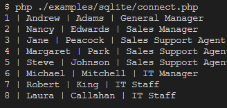
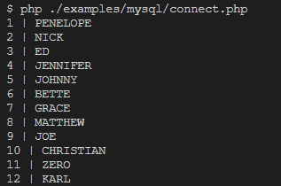

<div align="right">

### ⚡ RMM ⚡

</div>

# pdo-wrapper

Simples abstração de banco de dados em Php 8.x usando conector PDO

## Requisitos

- PHP 8.x
- extensões do PDO habilitadas no php.ini `pdo_sqlite`, `pdo_mysql` e `pdo_pgsql`  

## Características

Funciona com os seguintes bancos de dados

- Sqlite
- Mysql
- Postgre

## Como utilizar

```bash

if (! defined('RMM_VERSION')) {
    require_once dirname(dirname(__DIR__)) . '/autoload.php';
}

use RMM\Database;

$config = [
    'sqlite'=> [
        'driver' => 'sqlite',
        'database' => './examples/ex1/data/Chinook.db',
    ]
];

try {

    $db = new Database($config['sqlite']);

    $db->connect();

} catch (\Throwable $th) {
    print_r($th->getMessage());
    exit;
}


$connection = $db->getConnection();

```

E voilá, tem uma conexão com o banco.

Exemplo de consulta usando a conexão criada

```bash

$connection = $db->getConnection();

$stmt = $connection->query("SELECT EmployeeId, FirstName, LastName, Title FROM Employee");

foreach ($stmt as $row) {
    echo($row['EmployeeId'].' | '.$row['FirstName'].' | '.$row['LastName'].' | '.$row['Title'] . PHP_EOL );
}

unset($db);

```


## Exemplos

No diretório `examples` contém exemplos de conexão com bancos de dados diferentes usando dados de exemplo

Considere utilizar o Docker para validar facilmente os exemplos para `Mysql` e `Postgres`

Para rodar exemplo 1 [`SQLITE`]

``` bash
$ php ./examples/ex1/index.php
```

Retorno será algo como isso aqui




Para rodar exemplo 2 [`MYSQL`]

``` bash
$ php ./examples/ex2/index.php
```

Retorno será algo como isso aqui



Para rodar exemplo 3 [`POSTGRES`]

``` bash
$ php ./examples/ex3/index.php
```

Retorno será similar ao anterior (mysql)

## Docker

Acesse o diretório

``` bash
$ cd .docker/
```

Faça uma copia do arquivo de exemplo

``` bash
$ cp .env.example .env
``` 

As variáveis já possuem usuário e senha usados nos exemplos, mas é possível alterar como quiser. Se alterar apenas lembre-se de mudar em `examples/config/config.php` para que os exemplos continuem funcionando. 

Preencha as variáveis de acord
Para rodar os bancos de dados necessários para validar exemplos execute a instrução

``` bash
$ docker compose up -d

```

deve ocorrer algo como a imagem abaixo


No Docker desktop deve aparecer


Agora é só rodar os exemplos.